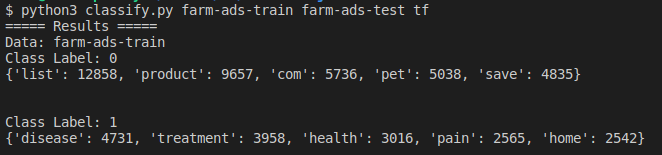
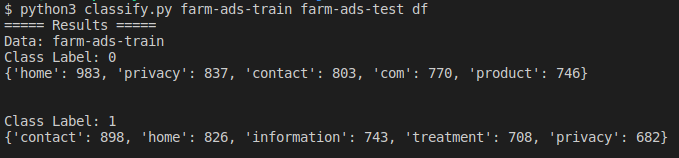
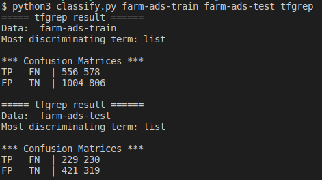
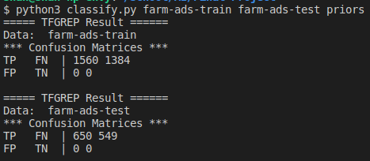
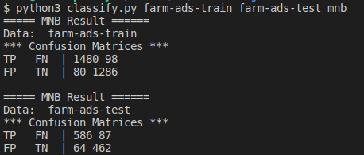
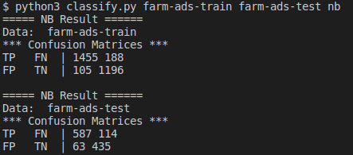
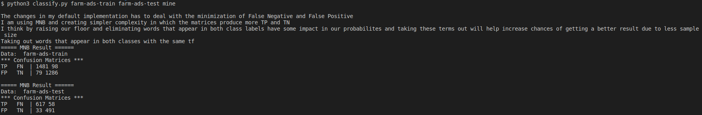

# AI Text Classification

Python implementation of multiple text classification methods for CS 440 Problem Set 7.

This project classifies farm advertisement text using term frequency, document frequency, baseline classification, Multinomial Naive Bayes, Multivariate Bernoulli Naive Bayes, and a custom reduced-vocabulary classifier.

## Project Overview

The assignment required a command-line Python script named `classify.py` that accepts:

1. a training data file
2. a testing data file
3. a function name to execute

Each line in the dataset contains one labeled document. The first value is the class label, and the remaining values are document terms.

## Files

| File | Purpose |
|---|---|
| `classify.py` | Main Python script containing all classifier functions |
| `farm-ads-train.txt` | Training dataset |
| `farm-ads-test.txt` | Testing dataset |
| `ps7.pdf` | Assignment instructions |
| `README.md` | Project documentation |
| `ALL_OUTPUTS.txt` | Full command output from the corrected version |
| `tf.csv` | Generated term-frequency output |
| `df.csv` | Generated document-frequency output |

## How to Run

```bash
python3 classify.py farm-ads-train.txt farm-ads-test.txt function
```

Replace `function` with one of the available function names.

## Available Functions

| Function | Description |
|---|---|
| `tf` | Computes term frequencies for each class and writes `tf.csv` |
| `df` | Computes document-frequency probabilities for each class and writes `df.csv` |
| `tfgrep` | Classifies documents using the most discriminating term |
| `priors` | Uses the majority-class baseline classifier |
| `mnb` | Runs Multinomial Naive Bayes |
| `nb` | Runs Multivariate Bernoulli Naive Bayes |
| `mine` | Runs a reduced-vocabulary version of Multinomial Naive Bayes |

## Example Commands

```bash
python3 classify.py farm-ads-train.txt farm-ads-test.txt tf
python3 classify.py farm-ads-train.txt farm-ads-test.txt df
python3 classify.py farm-ads-train.txt farm-ads-test.txt tfgrep
python3 classify.py farm-ads-train.txt farm-ads-test.txt priors
python3 classify.py farm-ads-train.txt farm-ads-test.txt mnb
python3 classify.py farm-ads-train.txt farm-ads-test.txt nb
python3 classify.py farm-ads-train.txt farm-ads-test.txt mine
```

## Term Frequency Output

The `tf` function counts how often each word appears in each class.

### Top Terms for Class 0

| Term | Frequency |
|---|---:|
| list | 12858 |
| product | 9657 |
| com | 5736 |
| pet | 5038 |
| save | 4835 |

### Top Terms for Class 1

| Term | Frequency |
|---|---:|
| disease | 4731 |
| treatment | 3958 |
| health | 3016 |
| pain | 2565 |
| home | 2542 |



## Document Frequency Output

The `df` function computes the probability that a document from each class contains a given term.

### Top Probabilities for Class 0

| Term | Probability |
|---|---:|
| home | 0.6301282051282051 |
| privacy | 0.5365384615384615 |
| contact | 0.5147435897435897 |
| com | 0.4935897435897436 |
| product | 0.4782051282051282 |

### Top Probabilities for Class 1

| Term | Probability |
|---|---:|
| contact | 0.6488439306358381 |
| home | 0.596820809248555 |
| information | 0.536849710982659 |
| treatment | 0.5115606936416185 |
| privacy | 0.49277456647398843 |



## TFGREP Results

The `tfgrep` function uses the most discriminating term to classify documents.

Most discriminating term: `list`

### Training Data

| Matrix | Predicted Class 0 | Predicted Class 1 |
|---|---:|---:|
| Actual Class 0 | TP = 435 | FN = 264 |
| Actual Class 1 | FP = 1125 | TN = 1120 |

### Test Data

| Matrix | Predicted Class 0 | Predicted Class 1 |
|---|---:|---:|
| Actual Class 0 | TP = 181 | FN = 117 |
| Actual Class 1 | FP = 469 | TN = 432 |



## Priors Results

The `priors` function uses a 0-R majority-class baseline.

### Training Data

| Matrix | Predicted Class 0 | Predicted Class 1 |
|---|---:|---:|
| Actual Class 0 | TP = 1560 | FN = 1384 |
| Actual Class 1 | FP = 0 | TN = 0 |

### Test Data

| Matrix | Predicted Class 0 | Predicted Class 1 |
|---|---:|---:|
| Actual Class 0 | TP = 650 | FN = 549 |
| Actual Class 1 | FP = 0 | TN = 0 |



## Multinomial Naive Bayes Results

The `mnb` function implements Multinomial Naive Bayes with Laplacian smoothing.

### Training Data

| Matrix | Predicted Class 0 | Predicted Class 1 |
|---|---:|---:|
| Actual Class 0 | TP = 1484 | FN = 71 |
| Actual Class 1 | FP = 76 | TN = 1313 |

### Test Data

| Matrix | Predicted Class 0 | Predicted Class 1 |
|---|---:|---:|
| Actual Class 0 | TP = 577 | FN = 84 |
| Actual Class 1 | FP = 73 | TN = 465 |



## Multivariate Bernoulli Naive Bayes Results

The `nb` function implements Multivariate Bernoulli Naive Bayes with Laplacian smoothing.

### Training Data

| Matrix | Predicted Class 0 | Predicted Class 1 |
|---|---:|---:|
| Actual Class 0 | TP = 1269 | FN = 67 |
| Actual Class 1 | FP = 291 | TN = 1317 |

### Test Data

| Matrix | Predicted Class 0 | Predicted Class 1 |
|---|---:|---:|
| Actual Class 0 | TP = 490 | FN = 73 |
| Actual Class 1 | FP = 160 | TN = 476 |



## Custom Reduced-Vocabulary Classifier

The `mine` function modifies the Multinomial Naive Bayes model by using a reduced vocabulary.

The reduced vocabulary removes terms that appear equally often in both class labels. These words add complexity without helping the classifier separate the two classes. This keeps the model simpler while still using discriminating terms for prediction.

In the corrected version, `mine` performs similarly to the standard Multinomial Naive Bayes model. The goal of this function is to demonstrate a valid reduced-complexity classifier rather than to claim a major performance improvement.

### Training Data

| Matrix | Predicted Class 0 | Predicted Class 1 |
|---|---:|---:|
| Actual Class 0 | TP = 1485 | FN = 74 |
| Actual Class 1 | FP = 75 | TN = 1310 |

### Test Data

| Matrix | Predicted Class 0 | Predicted Class 1 |
|---|---:|---:|
| Actual Class 0 | TP = 577 | FN = 85 |
| Actual Class 1 | FP = 73 | TN = 464 |



## Notes on Fixes

This final version keeps the same command-line behavior while improving correctness and reliability.

Fixes include:

- Replaced incorrect `is` comparisons with equality checks
- Corrected smoothing logic
- Reduced dependence on global variables
- Improved file handling
- Added clearer command help
- Kept the required assignment functions and output style
- Updated README with current output results
- Avoided overclaiming that the reduced-vocabulary model outperforms the standard model

## Technologies Used

- Python 3
- CSV file processing
- Naive Bayes classification
- Term frequency
- Document frequency
- Confusion matrices
